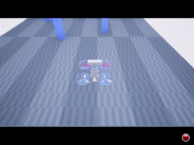

# Mapless Collision-Free Flight via MPC using Dual KD-Trees in Cluttered Environments

## 1. Introduction

Collision-free navigation in cluttered environments is essential for autonomous quadrotors. Traditional approaches typically rely on a cascade pipeline involving detailed 3D mapping, trajectory generation, and tracking. However, such methods can suffer from accumulated errors and computational latency, which limits agility and safety.

In this work, we propose a novel **mapless** method for collision-free flight without constructing explicit 3D maps or generating collision-free trajectories. Instead, we use **Model Predictive Control (MPC)** to directly generate safe control actions from sparse waypoints and point cloud data obtained from a depth camera.

Our approach introduces a **dual KD-tree** mechanism:
- The **Obstacle KD-Tree** identifies nearby obstacles for real-time avoidance.
- The **Edge KD-Tree** provides a strong initial guess to the MPC solver, helping it escape local minima.

We validate our method through both simulation and real-world experiments. Our results show that it:
- Outperforms traditional mapping-based approaches;
- Surpasses imitation learning-based methods;
- Achieves speeds of up to **12 m/s in simulation** and **6 m/s in real-world** scenarios.

This framework offers a robust and streamlined alternative to complex map-based planning systems.

📄 **[Read the full paper on arXiv](https://arxiv.org/abs/2503.10141)**

---

## 2. Installation
### 2.1 Tested Environments
This project has been tested under the following environments:
> Ubuntu 20.04 + ROS Noetic

### 2.2 Build CasADi

```bash
cd avoid_mpc
mkdir thirdparty && cd thirdparty
git clone https://github.com/casadi/casadi.git -b 3.6.4
mkdir build && cd build
cmake ../casadi -DWITH_BUILD_IPOPT=ON -DWITH_BUILD_MUMPS=ON -DWITH_IPOPT=ON -DWITH_MUMPS=ON -DWITH_OPENMP=ON -DCMAKE_INSTALL_PREFIX=../
make -j$(nproc)
make install
```
### 2.3 Build Roswrapper
```
 sudo apt install python3-catkin-tools
 sudo apt install libeigen3-dev
 sudo apt-get install libpcl-dev
 sudo apt install ros-noetic-mavros ros-noetic-mavros-extras ros-noetic-pcl-conversions
 sudo apt install ros-noetic-tf2-sensor-msgs
 cd roswrapper/ros
 source /opt/ros/noetic/setup.bash 
 catkin build
```
### 2.4 Generate the MPC Shared Library 
```
 pip3 install casadi
 cd roswrapper/ros/src/avoid_mpc
 python3 tools/mpc_obstacle_casadi.py
```
### 2.5 Download Simulator
```
wget https://zenodo.org/records/15004895/files/Obstacles.zip
unzip Obstacles.zip
```
## 3. Test On Airsim

Start a terminal and run airsim standalone
```
cd YOUR/SIMULARTOR/FOLDER
./tune_test.sh
```
Start another terminal to run avoid-MPC:
```
cd avoid_mpc/roswrapper/ros
source devel/setup.bash
roslaunch avoid_mpc mpc_obstacle_avoidance.launch
```
<p align="center">
  
</p>

## 4. TODO

- [ ] Release a simulation version based on [Flightmare](https://github.com/uzh-rpg/flightmare) to support richer visual-physical interaction scenarios
- [ ] Develop a ROS 2 compatible version to enable broader integration with modern robotic platforms

## 5. CItation
If you find this work useful in your research, please cite:

```
@article{zhang2025mapless,
  title={Mapless Collision-Free Flight via MPC using Dual KD-Trees in Cluttered Environments},
  author={Zhang, Linzuo and Hu, Yu and Deng, Yang and Yu, Feng and Zou, Danping},
  journal={arXiv preprint arXiv:2503.10141},
  year={2025}
}
```
